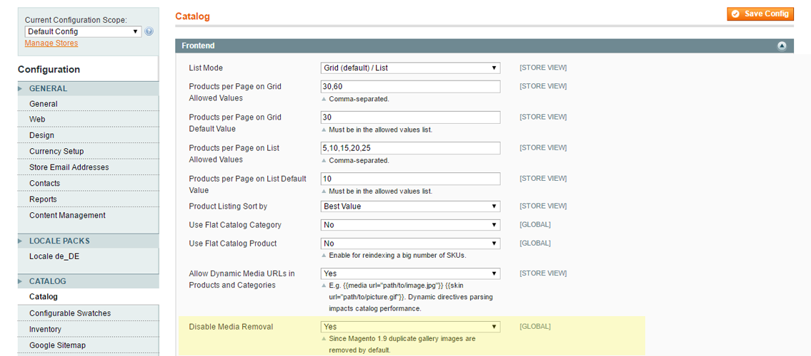

# Ambimax DisableMediaRemoval

Since Magento 1.9 duplicate images are removed from gallery. This module adds the ability to disable this behaviour.

Use at own risk!



## Tips

If your media gallery images disappear / vanish when visiting the frontend this might be the cause.

##  Installation

For installation use composer or copy files manually.

### composer
```
"require": {
    "ambimax/magento-module-ambimax-disablemediaremoval": "~1.0"
}
```

## License

[MIT License](http://choosealicense.com/licenses/mit/)

## Author Information

 - [Tobias Schifftner](https://twitter.com/tschifftner), [ambimax® GmbH](https://www.ambimax.de)
